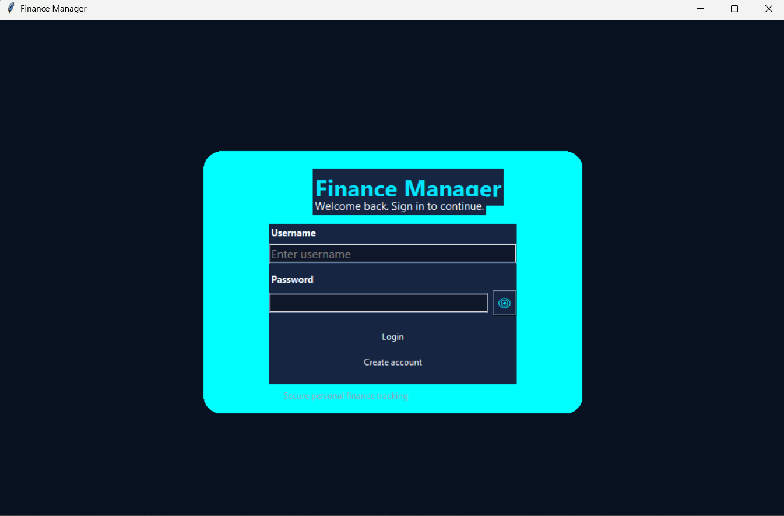
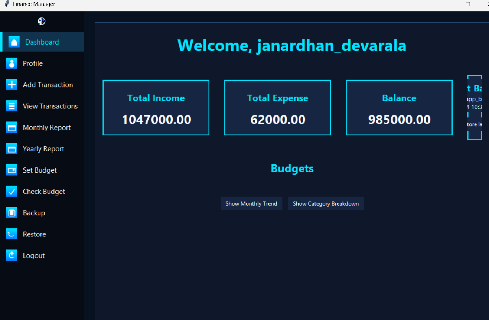
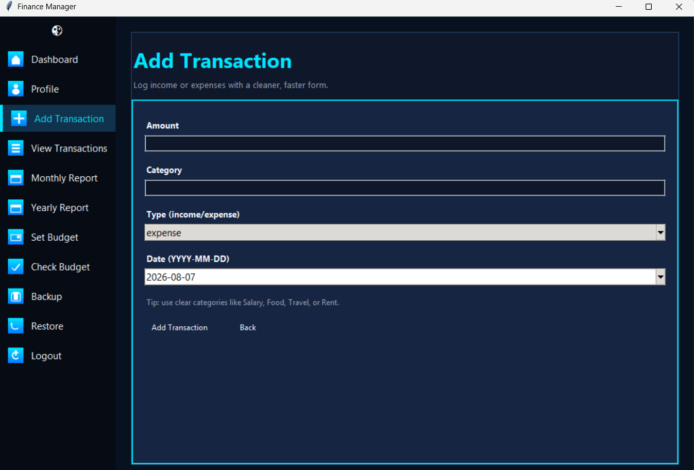
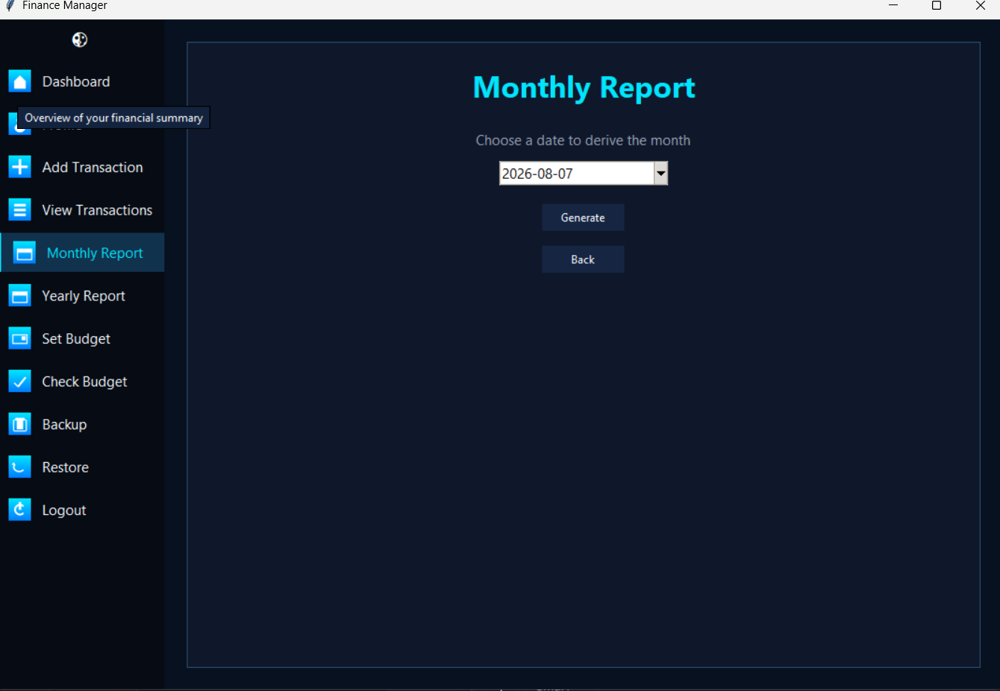
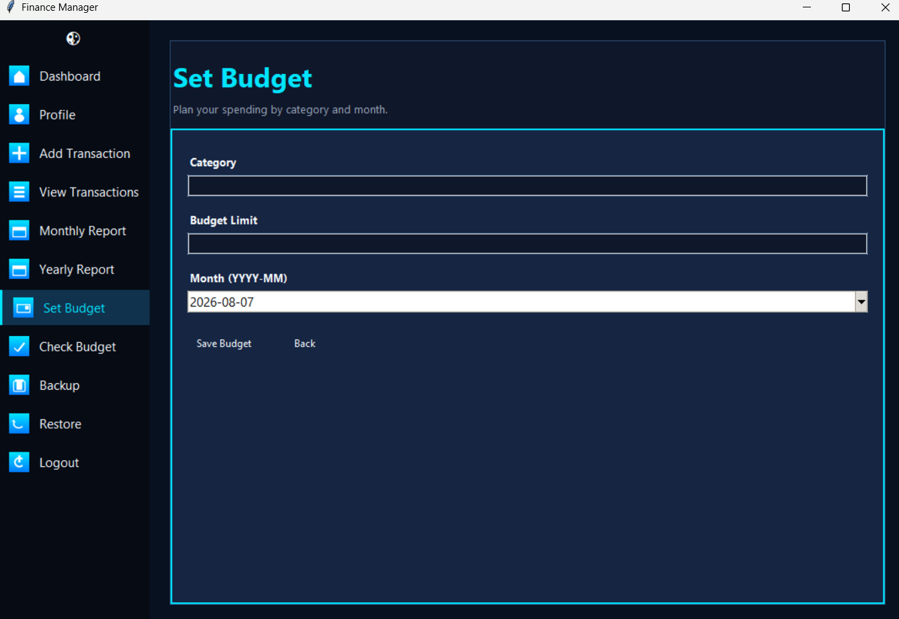
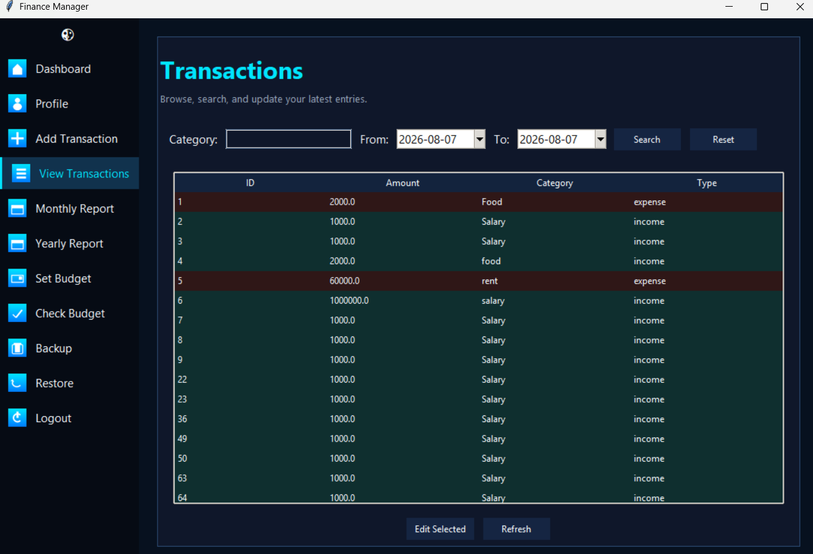
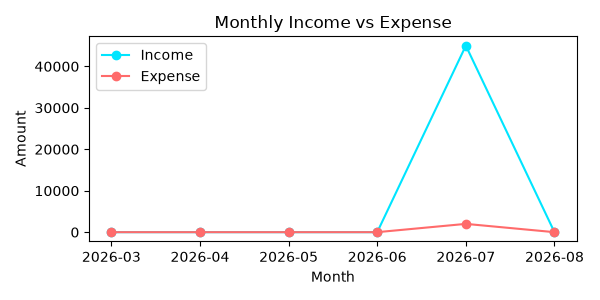
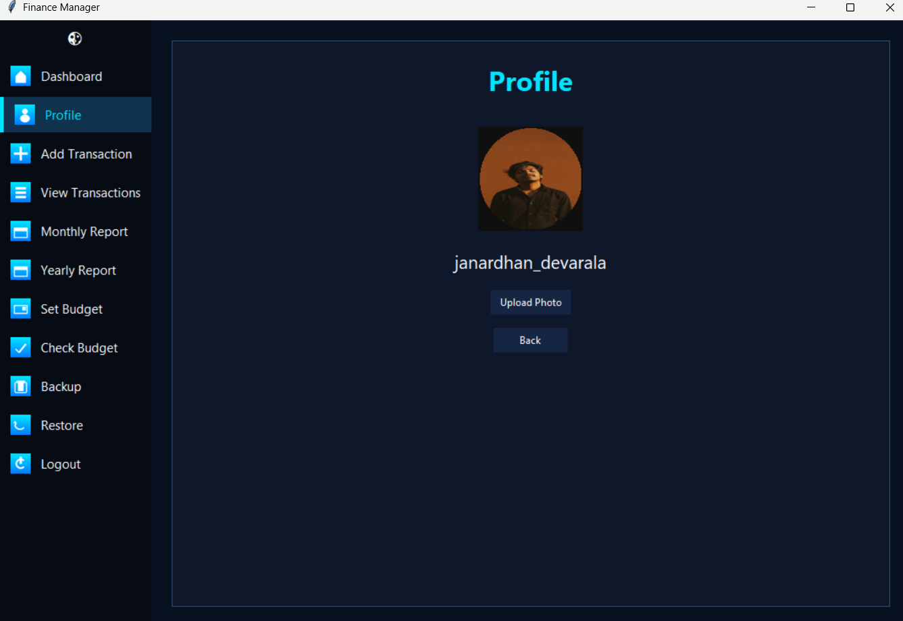

# Finance Manager — InnoByte Services Internship  
A Neon‑themed Personal Finance Manager built during my internship at **InnoByte Services**.  
This project includes authentication, dashboard analytics, transactions, budgeting, reports, and backup/restore features — all wrapped in a modern neon‑styled Tkinter GUI.

---

## 🚀 Features

### 🔐 Authentication  
- User Registration  
- Secure Login  
- Password visibility toggle  
- Placeholder input fields  

### 📊 Dashboard  
- Neon‑glow financial cards  
- Total Income / Expense / Balance  
- Dynamic charts:  
  - Income vs Expense  
  - Monthly Trend  
  - Category Breakdown  

### 💸 Transactions  
- Add new transactions  
- View all transactions in a sortable table  
- Auto‑calculated totals  
- Date picker using **tkcalendar**

### 📅 Reports  
- Monthly Report (Pie chart)  
- Yearly Report (Pie chart)  
- Neon‑styled charts using **Matplotlib**

### 🎯 Budget Management  
- Set monthly category budgets  
- Track budget usage  
- Alerts for overspending  

### 💾 Backup & Restore  
- Backup database  
- Restore previous financial data  

### 🎨 UI/UX  
- Frosted glass panels  
- Neon cyan theme  
- Sidebar with hover effects  
- Custom icons generated programmatically  
- Smooth animations and transitions  

---

## 🛠️ Tech Stack

| Component | Technology |
|----------|------------|
| GUI | Tkinter |
| Charts | Matplotlib |
| Database | SQLite |
| Calendar | tkcalendar |
| Images | Pillow (PIL) |
| Language | Python 3 |

---

## 📁 Project Structure

finance-manager-innobyte-services/
│
├── gui.py
├── auth.py
├── transactions.py
├── reports.py
├── budget.py
├── backup.py
├── database.py
│
├── icons/
│   ├── dashboard.png
│   ├── add.png
│   ├── view.png
│   ├── month.png
│   ├── year.png
│   ├── budget.png
│   ├── check.png
│   └── logout.png
│
├── docs/
│   ├── index.html
│   ├── style.css
│   ├── login.png
│   ├── Dashboard_1.png
│   ├── Add_transaction.png
│   ├── reports_1.png
│   ├── Budget_1.png
│   ├── view_transections.png
│   ├── monthly_trend.png
│   ├── Profile_1.png
│   └── live chart.png
│
└── README.md

Code

---

## 🌐 Live Project Documentation  
Your project documentation website is hosted using GitHub Pages:

👉 **https://janardhan-d.github.io/finance-manager-innobyte-services/**

This includes:  
✔ Features  
✔ Screenshots  
✔ Internship details  
✔ Download button  
✔ Neon‑themed UI showcase  

---

## 📸 Project Screenshots

### 🔐 Login Screen  


### 📊 Dashboard  


### 💸 Add Transaction  


### 📅 Reports  


### 🎯 Budget Management  


### 📁 View Transactions  


### 📈 Monthly Trend Chart  


### 👤 Profile Screen  


### 📊 Live Chart  


---

## 🔧 Installation & Setup

### 1️⃣ Clone the repository  
```bash
git clone https://github.com/janardhan-d/finance-manager-innobyte-services.git
cd finance-manager-innobyte-services
2️⃣ Install dependencies
bash
pip install pillow tkcalendar matplotlib
3️⃣ Run the application
bash
python gui.py
🧪 Testing
You can test features like:

Register/Login

Adding transactions

Viewing reports

Setting budgets

Backup/Restore

🤝 Contribution
If you'd like to contribute:

Fork the repository

Create a new branch

Commit your changes

Open a pull request

📜 License
This project is licensed under the MIT License.

👨‍💻 Author
Janardhan Devarala  
Intern — InnoByte Services
Python Developer | Tkinter GUI | Backend Development

⭐ If you like this project, give it a star — it helps a lot!
